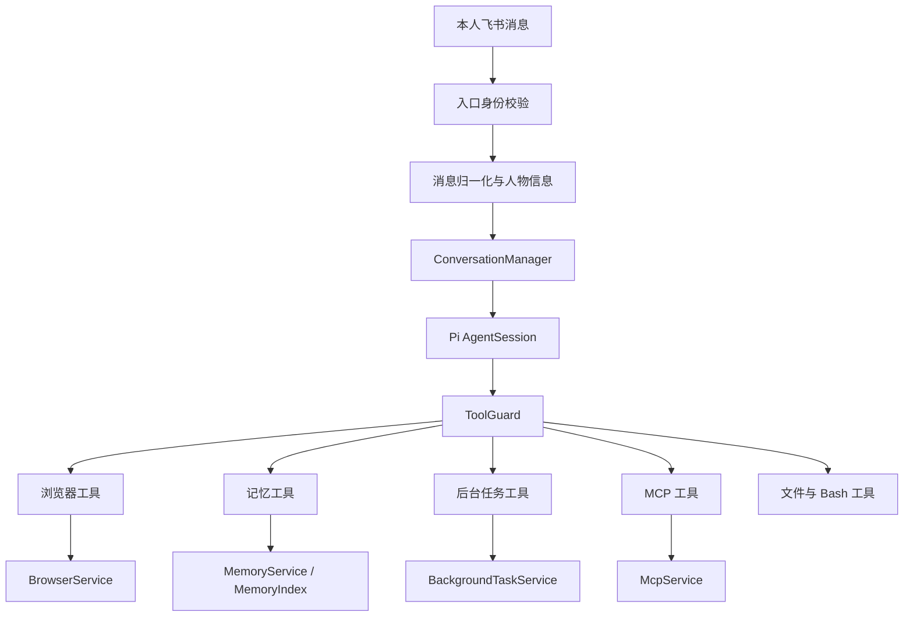

# 架构

mini-claw 是一个个人 Agent。Pi 负责模型与工具循环；工程负责交互入口、权限、执行服务和运行数据。没有团队分组或多用户授权模型。

## 调用链

## 模块边界

服务层管理状态与资源，不依赖飞书 SDK 或 Pi AgentSession。工具层把参数转给服务，把结果转成 Pi 内容块，不创建第二份状态。`AssistantServices` 装配四个服务，`main.ts` 注入身份通道、通知投递和前端。

| 模块 | 状态与职责 |
|---|---|
| `browser/service.ts` | 唯一个人浏览器队列、配置、持久化 profile、CLI argv；按需启动 |
| `memory/service.ts` | 个人 Markdown 原子写入、改写归档、本人历史来源 |
| `memory/index.ts` | 来源签名、增量更新、关键词评分、日期筛选、记录 ID |
| `tasks/service.ts` | 进程树、凭证代理租约、超时、限流、日志、任务记录、通知 |
| `mcp/service.ts` | 按需连接、发现、调用、配置过滤、取消、断线回收 |
| `resources/` | 资源选择配置、Pi 发现适配、一次加载的资源快照 |
| `tools/` | Tool 模块发现/校验、业务函数与独立 TS 脚本适配 |
| `process/` | 系统环境白名单、直接 argv 执行、进程树终止 |
| `permission/` | 个人规则解析、匹配和 mtime 缓存 |
| `guard/` | 确定性判定、ask 模型审核、本人确认卡 |

## 扩展资源

Skill、Tool 与 MCP 的边界和开发方法见 [扩展教程](extensions.md)。Skill/Tool 选择进入模型的资源，执行授权仍统一走 ToolGuard；MCP 连接由 McpService 按需持有，不由 Skill 负责生命周期。

## 身份

`FEISHU_PI_ADMIN` 绑定本人，可填写中文名、英文名或机器人应用对应的 Open ID。姓名仅从本地资料缓存唯一匹配，英文名忽略大小写；未缓存或重名时填写 Open ID。启动不查询通讯录或读取团队数据。

AI 的飞书 CLI 固定使用显式 `--as bot` 的本应用身份；用户态 CLI 拒绝。本人用户令牌仅供消息预处理的固定人物资料查询，不由模型调用。

传输层在资料查询、下载和 Agent 调用前拒绝其他发言人；卡片回调同样校验本人。运行时再次校验会话身份。个人部署仍保留独立会话和消息中的发言人信息，引用及历史内容不能自动变成执行指令。

旧群聊历史只在明确属于本人时进入个人检索。旧定时任务只恢复本人创建的条目。

## 权限

`deny > risk:high > ask > allow > default deny`。`ask` 才调用审核模型；模型失败或未配置回退本人确认。高风险标记覆盖 allow 和模型放行。

后台 start 投影为额外的 Bash 调用，MCP call 投影为具体工具调用，浏览器 upload 投影为 Read 调用；先检查所有投影的 deny，再审核 ask。不能用 `Tools(background_task)` 或 `Tools(mcp)` 覆盖底层规则。

复合 Bash 规则检查原命令、可解析的命令段与 CLI 归一化命令。规则是调用参数门禁，不是 OS 沙箱，无法穷尽任意程序内部行为。

## 生命周期

- 开机不启动浏览器、MCP 服务、记忆模型或模型心跳。
- 记忆查询按文件 mtime/size 增量更新索引；历史只索引 user/assistant 文本，跳过工具结果、思考和图像数据。
- 后台任务启动时取得身份通道租约，结束、取消或超时时关闭代理和进程树；日志限制 10 MiB。
- 重启后旧后台记录标记 interrupted，不自动恢复进程或重新执行命令。
- 正常退出停止定时调度，关闭后台任务、浏览器和 MCP，断开前端并释放实例锁。
- MCP 调用失败或断线不自动重放，避免重复副作用；下次操作可以重新连接。

依赖锁定于 `package-lock.json`；协议细节交给官方 MCP SDK 和 Playwright CLI。
